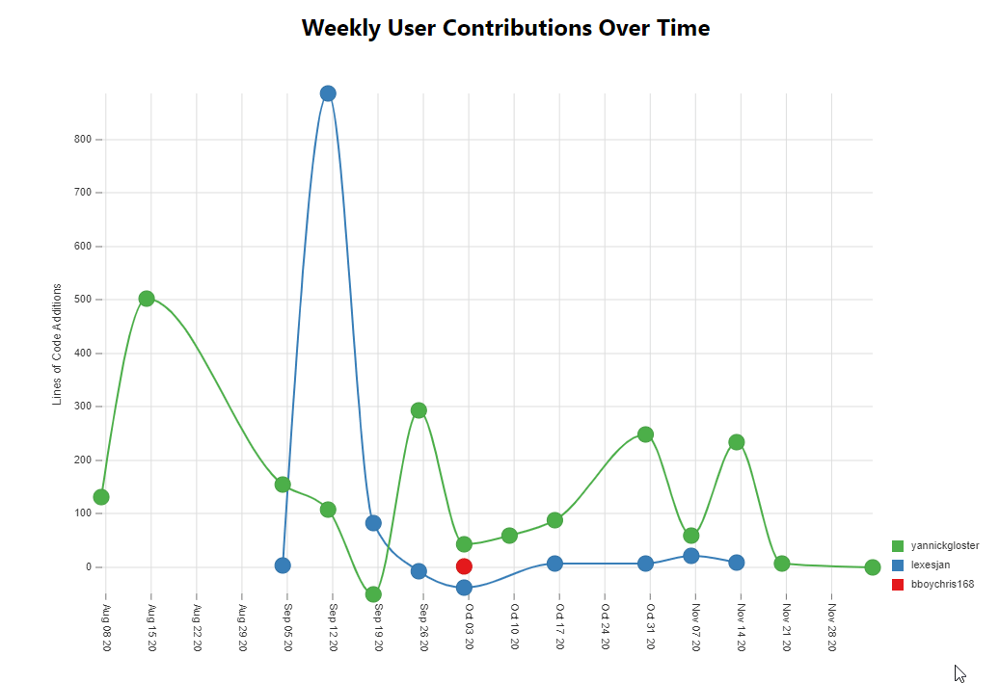
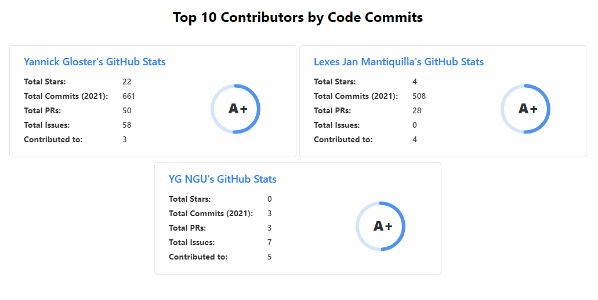
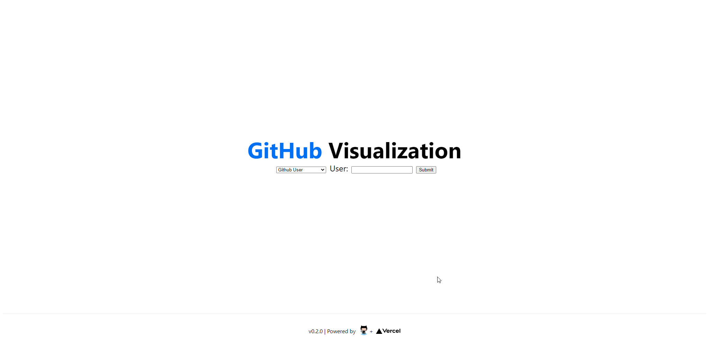

# Github Visualization tool

Built by Yannick Gloster | `18308167`

[Live Deployment](https://github-visualization.vercel.app/)

This project is built in Javascript using the Next.JS Framework. It is being hosted through Vercel.

This web app allows you to give your Github Username or Repository and displays statistics to determine your productivity and network.

To organizer my work and track my progress, I used Github's [Project Board](https://github.com/yannickgloster/Github-Visualization/projects/1). I broke down the project into tasks so that I could keep track of my own personal productivity.

[](https://github.com/yannickgloster/Github-Visualization/projects/1)

## Docker

Before compiling on docker, you need to setup the `.env` file. This file contains the [Github API Personal Token](https://github.com/settings/tokens/). Without this token, the application would run out of requests as the Github API is rate limited to 60 requests per hour without a personal token and 5000 requests per hour with the token.

After cloning the repository, in the working directory, create a file called `.env`

```bash
NEXT_PUBLIC_GITHUB_API_KEY=<YOUR TOKEN HERE>
```

### Build

Once that is set, you can build the Docker image with the command:

```bash
docker build -t client .
```

### Deploy

You can then deploy the the app using the following command:

```bash
docker run --name CLIENT_CONTAINER -p 0.0.0.0:5000:3000 client
```

You can then access the site at [http://localhost:5000/](http://localhost:5000/)

## Features

### Searching


A user can search for users or specific repositories.

The search bar also has a set of presets that someone can use to see example of the visualizer in use.


### User Visualization

#### Overview

Here is a card that gives an overview of a Github User's statistics and performance during the current year.


> Available ranks are S+ (top 1%), S (top 25%), A++ (top 45%), A+ (top 60%), and B+ (everyone). The values are calculated by using the cumulative distribution function using commits, contributions, issues, stars, pull requests, followers, and owned repositories.

#### Productivity Hours Pie Chart

People tend to be productive at different hours of the day and a good metric of understanding when one is most productive is by looking at when a user is most productive in terms of their Github activity. This data can be used by users to plan their schedules around when they know they will get the most amount of work done.


#### Activity Calendar

Similarity to the productivity hours chart, people get work during different days of the week and during different periods during the year. My activity calendar displays each day that a user had any Github activity. The darker the green, the more activity the user has had on that specific date. You can also select what year you want to look at.


To get this information from Github, I had to query the [Github GraphQL API](https://docs.github.com/en/free-pro-team@latest/graphql/overview/about-the-graphql-api). Github's v4 API is through GraphQL instead of REST endpoints. When querying the GraphQL API, a developer can get only the information that they need and can connect information across multiple different sections all with 1 single request.

To demonstrate how to have some actual security when creating endpoints, I created an API endpoint on the server side for this request. This request can be found in [`pages/api/contributions.js`](pages/api/contributions.js). By using this endpoint, the client cannot access the the API key being used to query the Github API. To test this endpoint you can access it here: [github-visualization.vercel.app/api/contributions?user=yannickgloster](https://github-visualization.vercel.app/api/contributions?user=yannickgloster).

#### User Connections

Another way to track users is through their interactions with other members on the platform. This network graph connects users by 2 degrees (It connects a users followers and then all of the followers' followers). The main user is the bigger red node. Each user then has a randomized color. The thicker the line between people shows what level of connection they have.


#### List Repos

All of the user's public repos have their own clickable info card.


### Repositories

Here is a clickable card that gives an overview of a Github Repo's statistics.


#### Weekly Contributions over time

This graph shows the number of lines of code added or removed per user per week.



#### Top 10 Contributors

Shows the clickable info cards for the top 10 contributors in the repository ordered by who has contributed the most amount of lines.



### Search

#### Example User Search


#### Search Error


